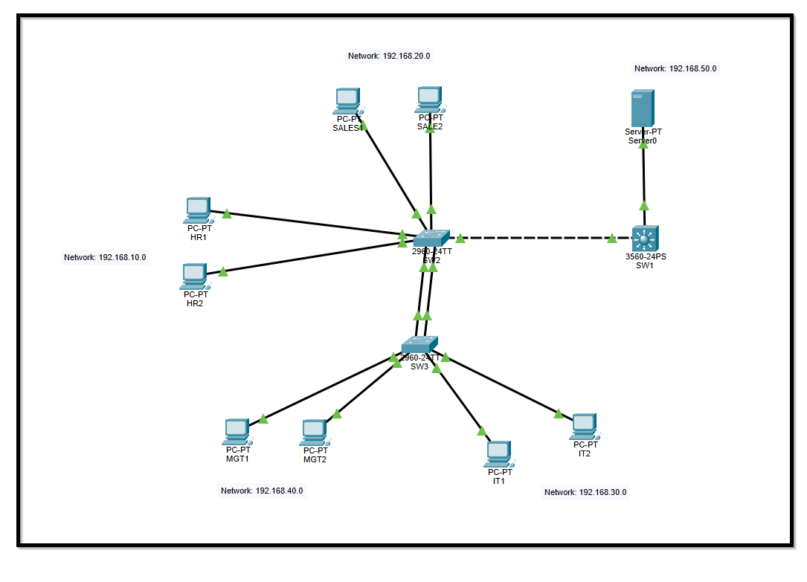
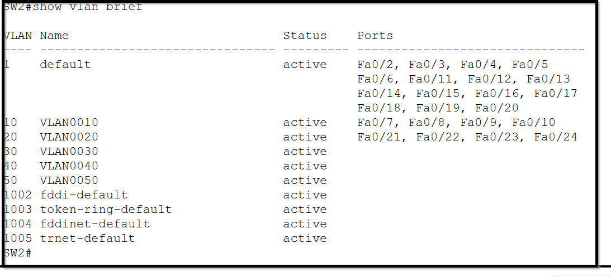
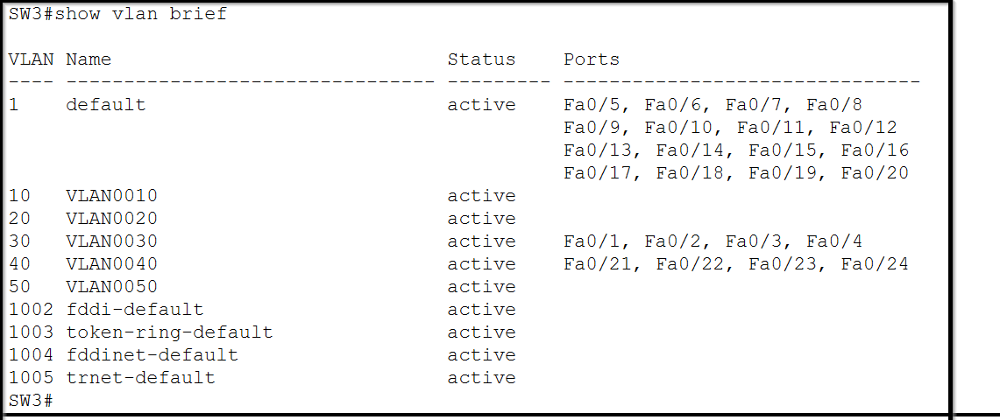
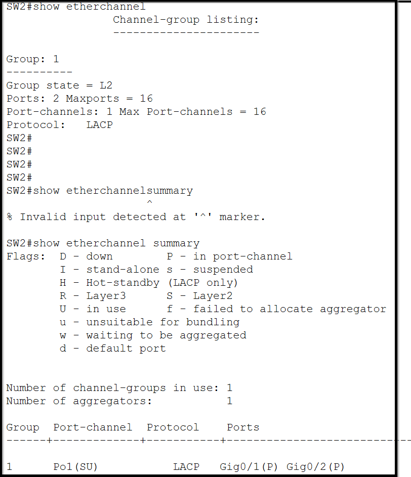
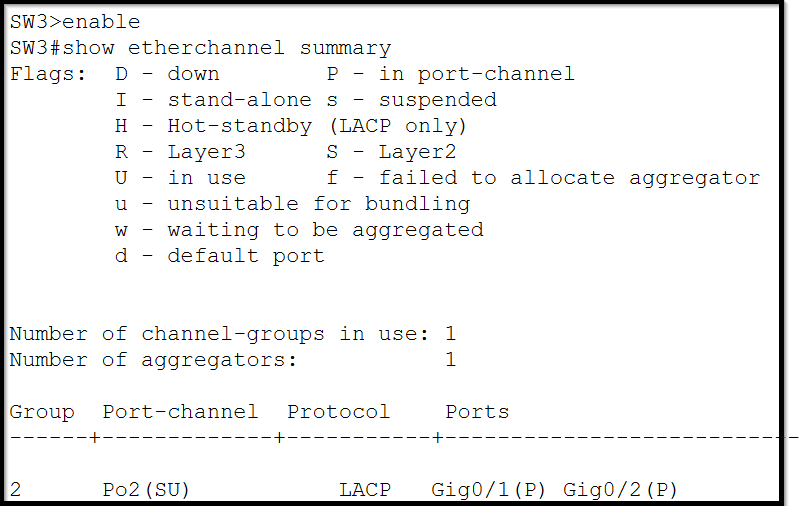
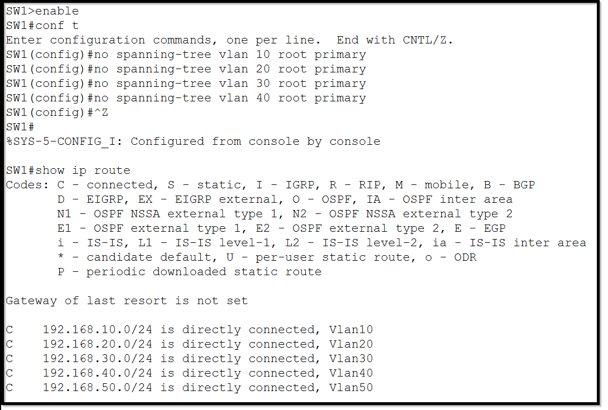
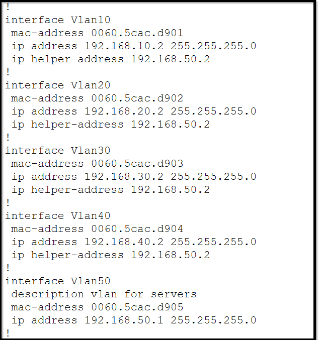
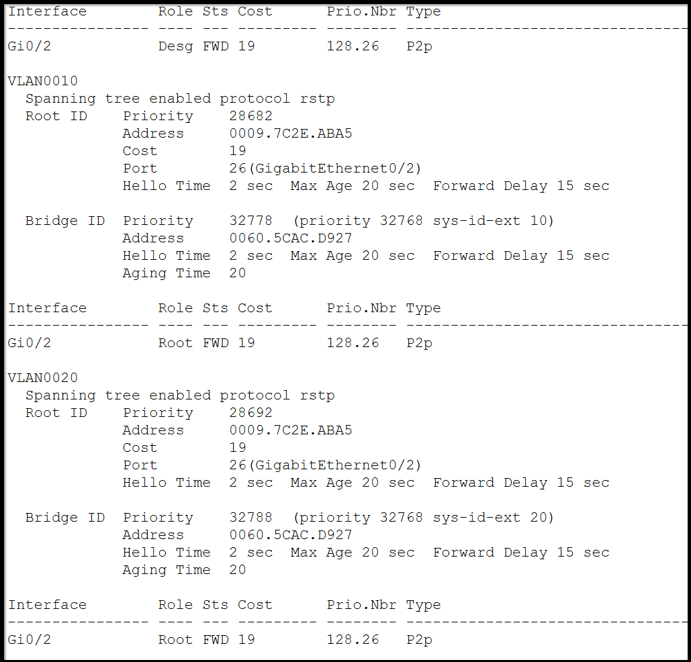

# 🏢 Advanced VLAN Segmentation, STP Optimization & EtherChannel Implementation

## 📌 Network Topology Setup


Explanation: 
This section describes the overall structure of the network, including the placement of switches and VLAN assignments. The topology ensures proper segmentation and communication between different VLANs.
```
Layer 3 Switch (SW1) is placed on the right side of the network and connects to SW2 via GigabitEthernet0/2.
Layer 2 Switch (SW2) is positioned to the left of SW1 and connects via FastEthernet0/1.
SW2 connects to SW3 using an EtherChannel (GigabitEthernet1/1 & GigabitEthernet1/2).
VLAN Assignments:
   - HR (VLAN 10) and Sales (VLAN 20) are connected to SW2.
   - Management (VLAN 40) and IT (VLAN 30) are connected to SW3.
```

## 🔹 SW2 Configuration

Explanation: SW2 is configured as the root bridge for the Rapid PVST spanning-tree protocol. The VLANs are assigned to specific ports to segregate network traffic and improve security. PortFast and BPDU Guard are enabled to place access ports into a forwarding state immediately while preventing possible loops if a switch is connected to an access port.
```
enable
configure terminal
spanning-tree mode rapid-pvst

interface range f0/7-10
switchport mode access
switchport access vlan 10
description HR VLAN
exit

interface range f0/21-24
switchport mode access
switchport access vlan 20
description Sales VLAN
exit

spanning-tree portfast
spanning-tree bpduguard enable

vlan 30
vlan 40
exit

spanning-tree vlan 10 root primary
spanning-tree vlan 20 root primary
spanning-tree vlan 30 root primary
spanning-tree vlan 40 root primary
```

## 🔹 SW3 Configuration

Explanation: SW3 is configured as the secondary root bridge to provide redundancy. VLAN assignments are made to ensure proper connectivity between departments. Similar to SW2, PortFast and BPDU Guard are enabled to maintain network stability and speed up convergence.
```
enable
configure terminal
spanning-tree mode rapid-pvst

interface range f0/1-4
switchport mode access
switchport access vlan 30
description IT VLAN
exit

interface range f0/21-24
switchport mode access
switchport access vlan 40
description Management VLAN
exit

spanning-tree portfast
spanning-tree bpduguard enable

vlan 10
vlan 20
exit

spanning-tree vlan 10 root secondary
spanning-tree vlan 20 root secondary
spanning-tree vlan 30 root secondary
spanning-tree vlan 40 root secondary
```

## 🔹 EtherChannel Configuration (SW2)


Explanation: EtherChannel is implemented using LACP to bundle multiple physical links into one logical connection. This increases bandwidth and provides redundancy in case one link fails.
```
enable
configure terminal
interface range g0/1-2
switchport mode trunk
channel-group 1 mode active
speed 1000
duplex full
switchport trunk native vlan 99
exit
```

## 🔹 EtherChannel Configuration (SW3)

```
enable
configure terminal
interface range g0/1-2
switchport mode trunk
channel-group 2 mode passive
speed 1000
duplex full
switchport trunk native vlan 99
exit
```

## 🔹 Inter-VLAN Routing on SW1 (Layer 3 Switch)

Explanation: Inter-VLAN routing allows communication between different VLANs using Switched Virtual Interfaces (SVIs). The Layer 3 switch is configured to handle this routing, ensuring efficient packet forwarding between VLANs.
```
enable
configure terminal
vlan 10
vlan 20
vlan 30
vlan 40

ip routing

interface vlan 10
ip address 192.168.10.2 255.255.255.0

interface vlan 20
ip address 192.168.20.2 255.255.255.0

interface vlan 30
ip address 192.168.30.2 255.255.255.0

interface vlan 40
ip address 192.168.40.2 255.255.255.0
exit

interface g0/2
switchport trunk native vlan 99
exit
```

## 🔹 Verification Commands
Explanation: These commands are used to verify that the VLANs, spanning tree, EtherChannel, and inter-VLAN routing configurations are correctly applied and functioning as expected.
```
show vlan brief         # Verify VLAN assignments 
show running-config     # Check overall switch configuration
show spanning-tree      # Verify STP status
```





